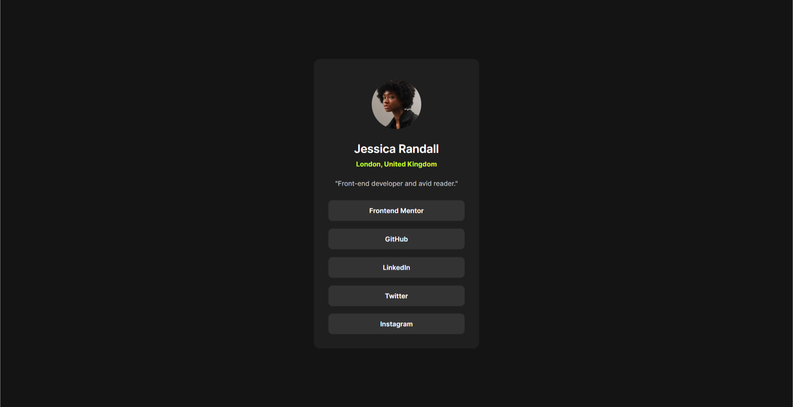

# Frontend Mentor - Social links profile solution

This is a solution to the [Social links profile challenge on Frontend Mentor](https://www.frontendmentor.io/challenges/social-links-profile-UG32l9m6dQ). Frontend Mentor challenges help you improve your coding skills by building realistic projects. 

## Table of contents

- [Overview](#overview)
  - [The challenge](#the-challenge)
  - [Screenshot](#screenshot)
  - [Links](#links)
- [My process](#my-process)
  - [Built with](#built-with)
  - [What I learned](#what-i-learned)
- [Author](#author)

## Overview

This project involved using flexbox, grid, pseudoclasses, combinator selectors and even custom values for code reuse.

### The challenge

Users should be able to:

- View the optimal layout for the site depending on their device's screen size
- See hover states for all interactive elements on the page

### Screenshot

### Links

- Solution URL: [GitHub](https://github.com/ronitzdev/social-links-profile)
- Live Site URL: [Live](https://social-links-ronitzdev.netlify.app/)

## My process

### Built with

- Semantic HTML5 markup
- CSS custom properties
- Flexbox
- CSS Grid
- Mobile-first workflow

### What I learned

Deliberate practice, with what is on my mind, I like to challenge myself more and more so I know what else I need to polish. It helped me understand my own workflow and the way I approach solutions.

## Author

- Website - [GitHub](https://github.com/ronitzdev)
- Frontend Mentor - [@ronitzdev](https://github.com/ronitzdev)
